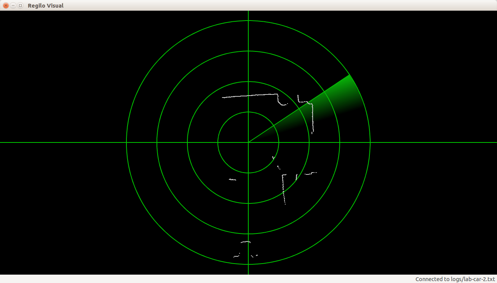

# Regilo
[](https://travis-ci.org/branoholy/regilo)
[](https://github.com/branoholy/regilo/releases)
[](https://github.com/branoholy/regilo#download)
[](LICENSE)

*A simple C++ library for controlling the Neato XV robot and the Hokuyo scanner.*

`regilo` allows you to communicate with the Neato robot or the Hokuyo scanner
through a serial port or sockets. You can use some implemented methods
like `setTestMode()`, `setMotor()` (for Neato XV), `getVersion()` (for Hokuyo),
`getScan()` (for both), or run any other command with the `sendCommand()`
method.

## Download
In the supported operating systems (currently Arch Linux, Debian, Ubuntu, and
Fedora), you can install the appropriate [package](#packages). Otherwise, you
can download [the source code](https://github.com/branoholy/regilo/releases),
build `regilo` according to the [build instructions](#build) below, and
[install](#installation) it.

## Usage

### Neato XV
```cpp
// Create the controller
regilo::NeatoSocketController controller;

// Connect it
controller.connect("10.0.0.1:12345");

// Set the test mode and LDS rotation
controller.setTestMode(true);
controller.setLdsRotation(true);

// Grab a scan from the robot
regilo::ScanData data = controller.getScan();

// Unset the test mode and LDS rotation
controller.setLdsRotation(false);
controller.setTestMode(false);
```

### Hokuyo
```cpp
// Create the controller
regilo::HokuyoSerialController controller;

// Connect it
controller.connect("/dev/ttyACM0");

// Grab a scan from the scanner
regilo::ScanData data = controller.getScan();
```

## Dependencies
The library uses

* [Boost.Asio](http://www.boost.org/doc/libs/release/doc/html/boost_asio.html)
library (version 1.54 or newer),
* [Boost String Algorithms Library](http://www.boost.org/doc/libs/release/doc/html/string_algo.html)
(version 1.54 or newer).

The `regilo-visual` example also needs

* [wxWidgets](https://www.wxwidgets.org) library (version 3.0 or newer).

## Build
Make sure you have installed all necessary [dependencies](#dependencies) before
building.

```text
$ mkdir build && cd build
$ cmake ..
$ make
```

Use one of the following options if you want to build the
[examples](examples) as well

* `$ cmake -Dexample:bool=on ..` for the console example (`regilo-scan`),
* `$ cmake -Dexample-gui:bool=on ..` for the GUI example (`regilo-visual`),
* `$ cmake -Dexamples:bool=on ..` for all examples.

For a faster build on a multicore processor, you can use:

```text
$ make -j$(nproc)
```

## Installation
To install the `regilo` library (and its examples), simply run as root:

```text
# make install
```

To uninstall:

```text
# make uninstall
```

### Packages
There are three packages you can install. The package names adhere to the
conventions of the operating systems.

| Operating system | Package name    | Package content                 |
| ---------------- | --------------- | ------------------------------- |
| Arch Linux       | `regilo-lib`    | only runtime library            |
|                  | `regilo`        | library, headers, `regilo-scan` |
| Debian / Ubuntu  | `libregilo`     | only runtime library            |
|                  | `libregilo-dev` | library, headers, `regilo-scan` |
| Fedora           | `regilo`        | only runtime library            |
|                  | `regilo-devel`  | library, headers, `regilo-scan` |
| All              | `regilo-visual` | library, `regilo-visual`        |

#### Arch Linux
You can install `regilo`, `regilo-lib`, and `regilo-visual` in Arch Linux from
the [AUR](https://aur.archlinux.org/packages/?K=regilo).

Do not forget to add
[my PGP key](http://pgp.mit.edu/pks/lookup?search=0xD25809BF3563AA56A12B0F4D545EDD46FBAC61E6&fingerprint=on)
(fingerprint `D258 09BF 3563 AA56 A12B  0F4D 545E DD46 FBAC 61E6`).

```text
$ gpg --recv-key D25809BF3563AA56A12B0F4D545EDD46FBAC61E6
```

#### Ubuntu
In Ubuntu, you can use my [ppa:branoholy/regilo](https://launchpad.net/~branoholy/+archive/ubuntu/regilo)
and install the `libregilo`, `libregilo-dev`, and `regilo-visual` packages.

```text
$ sudo add-apt-repository ppa:branoholy/regilo
$ sudo apt-get update
$ sudo apt-get install libregilo-dev
```

#### Debian
[openSUSE Build Service](https://build.opensuse.org/project/show/home:branoholy:regilo)
can be used in Debian 8. You need to add my key and repository, and then you can
install the `libregilo`, `libregilo-dev`, and `regilo-visual` packages.

```text
$ sudo sh -c "wget http://download.opensuse.org/repositories/home:/branoholy:/regilo/Debian_8.0/Release.key -O - | apt-key add -"
$ sudo sh -c "echo 'deb http://download.opensuse.org/repositories/home:/branoholy:/regilo/Debian_8.0/ ./' >> /etc/apt/sources.list"
$ sudo apt-get update
$ sudo apt-get install libregilo-dev
```

#### Fedora
[openSUSE Build Service](https://build.opensuse.org/project/show/home:branoholy:regilo)
can be used in Fedora 23 as well. You need to add my repository and then you can
install the `regilo`, `regilo-devel`, and `regilo-visual` packages.

```text
$ sudo dnf config-manager --add-repo http://download.opensuse.org/repositories/home:/branoholy:/regilo/Fedora_23/home:branoholy:regilo.repo
$ sudo dnf install regilo-devel
```

## Examples
See [examples](examples) for
more information about using of this library.

`regilo-scan` is a simple example that connects to the Neato or Hokuyo, performs
one scan, and prints it.

`regilo-visual` is more complex and requires the `wxWidgets` library. It can be
used to drive with the Neato, scan automatically or manually, and log the
output. Same scanning functionality can be done with the Hokuyo as well.

[](examples/regilo-visual)

## License
Regilo is licensed under GNU GPL v3 (see
[LICENSE](LICENSE) file).

